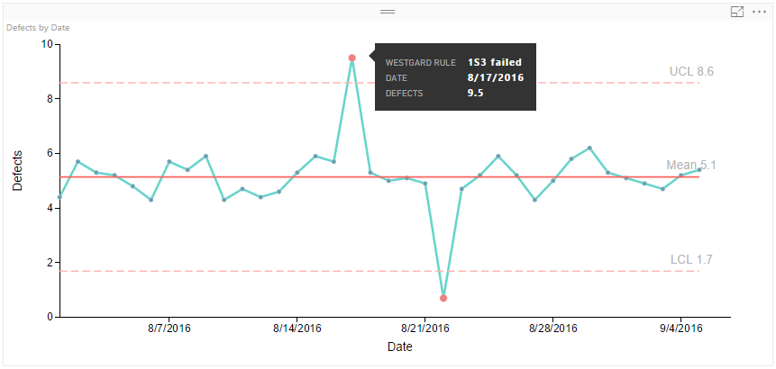
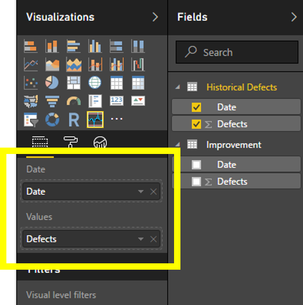
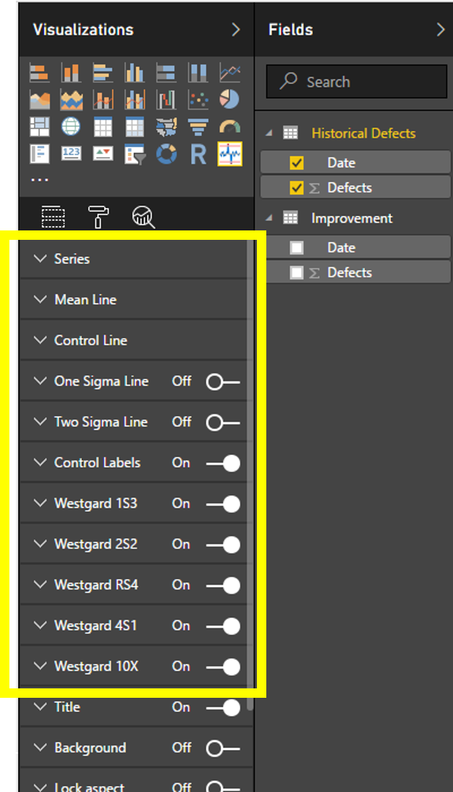

# Process Control Chart
## Power BI Custom Visual - Process Control Chart

The Process Control Chart can be used to visualize variation in the output of a process against control limits. Measurements are plotted against a mean and statistical control limits at a range of +/- 1, 2, and 3 sigmas (Standard Deviation) from the mean. Theory behind control charts gives insight to identify outliers, special cause deviations, and common cause deviations. All calculations of mean and sigma are automatically calculated against the data set, and outliers are identified in the visual.

This custom visual allows the user to select from a set of [Westgard Rules](http://www.ncss.com/wp-content/themes/ncss/pdf/Procedures/NCSS/Levey-Jennings_Charts.pdf)  through capability option settings.

Here is a sample screenshot showing the Process Control Chart visual with couple of outliers and a tooltip showing details of one of the outliers, 

Learn more...

1. [Process Control Chart Data Roles](README.md#process-control-chart-data-roles)
2. [Process Control Chart Capability Options](README.md#process-control-chart-capability-options)

## Process Control Chart Data Roles

Following diagram show Process Control Chart Data Roles.

|Data Role|Description|Constraints|
|---|---|---|
|Date|The data values for date axis of the control chart. These dates will be layed on the x axis.|None.|
|Values|The measure that should be plotted against the y axis of the control chart.|These should be numerical values.|

## Process Control Chart Capability Options

Process Control Chart Visual provides eleven Capability Option groups highlighted in the figure below. These include 6 capability groups to control visual components which are "Series", "Mean Line", "Control Line", "One Sigma Line", "Two Sigma Line", "Control Labels". In addition there are 5 more capability groups to control Westgard Rules which are "Westgard 1S3","Westgard 2S2","Westgard RS4","Westgard 4S1", "Westgard 10X".

Following diagram show Process Control Chart Capability Options.

Learn more about Process Control Chart Capability Options [here](documentation/README.md).
