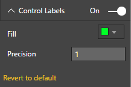
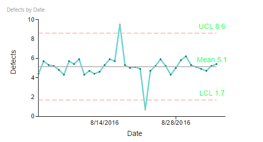

# Process Control Chart Capability Options

## Control Labels

## Control Labels - Custom Settings
"Control Labels" Capability options help in setting display properties of Control Labels. Following example shows customized Control Labels settings. In this example, Control Labels Color is set a Greenish shade. In addition you can optionally show/hide control labels and set precision level.

| Figure 1. “Control Labels” Settings. | Figure 2. Process Control Chart with "Control Labels" set to Greenish shade. |
|---|---|
|   |  |
