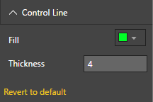
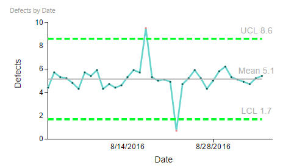

# Process Control Chart Capability Options

## Control Line

## Control Line - Custom Settings
"Control Line" Capability options help in setting display properties of Control lines. Following example shows customized Control Line settings. In this example, the Color of the Control Line is set to a Greenish shade and Thickness to 4. 

| Figure 1. “Control Line” Settings. | Figure 2. Process Control Chart with custom Color and Thickness for "Control Line". |
|---|---|
|   |  |
