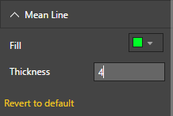
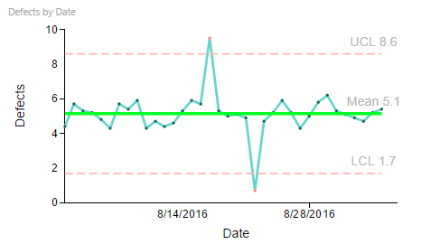

# Process Control Chart Capability Options

## Mean Line

## Mean Line - Default Settings
"Mean Line" Capability options help in setting display properties of the mean line. Following example shows customized Mean Line settings. In this example, the Color of the Mean Line is set to a Greenish shade and Thickness to 4. 

| Figure 1. “Mean Line” Settings. | Figure 2. Process Control Chart with custom Color and Thickness for "Mean Line". |
|---|---|
|   |  |
