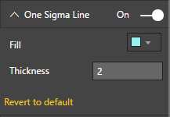
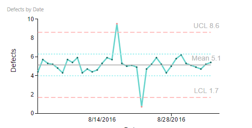

# Process Control Chart Capability Options

## One Sigma Line

## One Sigma Line - Custom Settings
"One Sigma Line" Capability options help in setting display properties of One Sigma Lines. Following example shows customized One Sigma Line settings. In this example, One Sigma Line is set to Visible.

| Figure 1. “One Sigma Line” Settings. | Figure 2. Process Control Chart with "One Sigma Line". |
|---|---|
|   |  |
