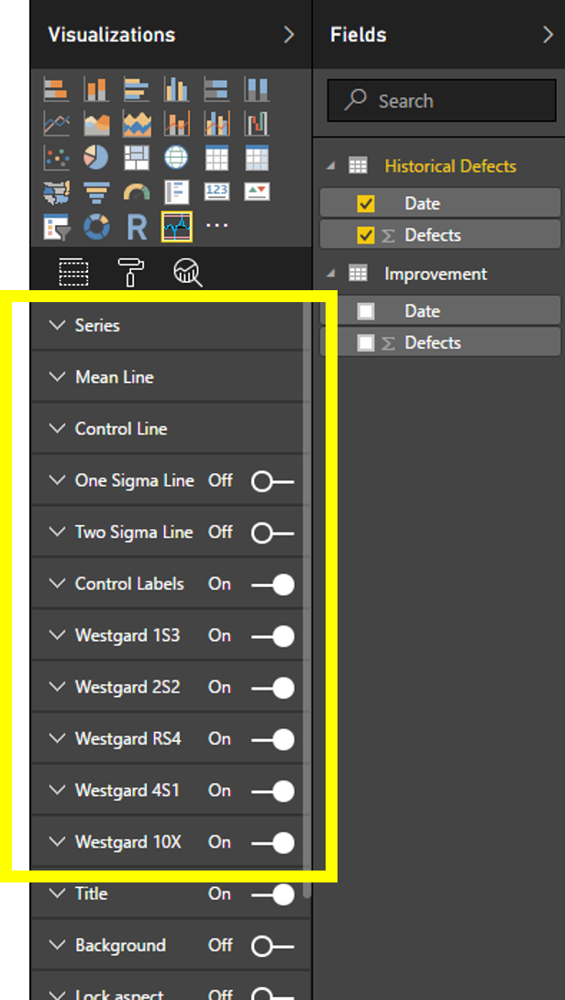

# Process Control Chart Capability Options
​
These include 6 capability groups to control visual components which are "Series", "Mean Line", "Control Line", "One Sigma Line", "Two Sigma Line", "Control Labels". In addition there are 5 more capability groups to control Westgard Rules which are "Westgard 1S3","Westgard 2S2","Westgard RS4","Westgard 4S1", "Westgard 10X".  
Following diagram shows Process Control Chart Capability Options.  
  
Read more about each of the capability options,
 
 1. [Series](Series.md)
 2. [Mean Line](MeanLine.md)
 3. [Control Line](ControlLine.md)
 4. [One Sigma Line](OneSigmaLine.md)
 5. [Two Sigma Line](TwoSigmaLine.md)
 6. [Control Labels](ControlLabels.md)
 7. [Westgard 1S3](Westgard1S3.md)
 8. [Westgard 2S2](Westgard2S2.md)
 9. [Westgard RS4](WestgardRS4.md)
10. [Westgard 4S1](Westgard4S1.md)
11. [Westgard 10X](Westgard10X.md)
​
