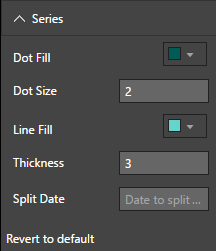
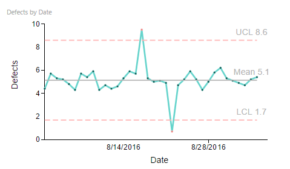
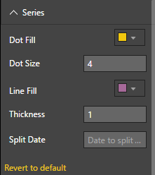
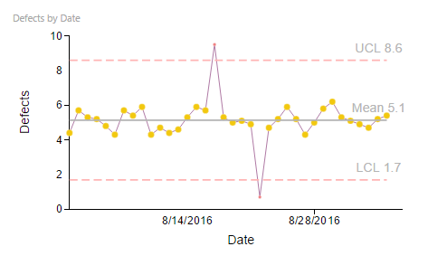
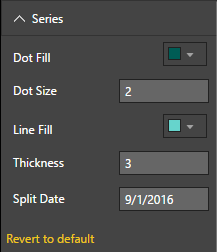
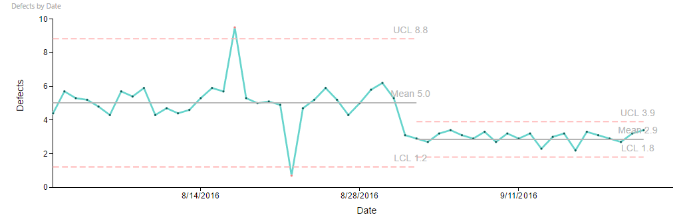

# Process Control Chart Capability Options

## Series

## Series - Default Settings
"Series" Capability options help in setting display properties of line and dots that plot data points. Figure 1 and Figure 2 show default settings for "Series" and a control chart with defaults for "Series". 

| Figure 1. “Series” Default Option Settings. | Figure 2. Process Control Chart with default settings for "Series". |
|---|---|
|   |  |

|Option|Default Value|Description|
|---|---|---|
|Dot Fill|#005C55|Color of dots indicating data points|
|Dot Size|2|Size of dots indicating data points|
|Line Fill|rgb(102, 212, 204)|Color of line segments connecting data points|
|Thickness|3|Size of line segments connecting data points|
|Split Date||Date to split the data. Useful in visualizing process improvement impact|

## Series - Dot Fill, Dot Size, Line Fill, Line Size
Following example shows customized Dot and Line settings. In this example, the Color of Dots are set to a Yellowish shade and size to 4, Line color is set to a shade of Purple while thickness is reduced to 1. 

| Figure 3. Dot Fill, Dot Size, Line Fill, Line Size customized | Figure 4. Process Control Chart with customized Dot Fill, Dot Size, Line Fill, Line Size |
|---|---|
|   |  |

## Series - Split Date
One of the practical uses of process control chart is to visualize the impact of process improvement initiatives. In process quality control for example, process improvement goals involve reducing mean defects and daily variation of defects. Process Control Chart Visual helps with this by letting its users specify the date on which process improvement initiatives were introduced. Process Control Chart will split the series in to two segments, before and after this "Split Date" and will plot them against old and new control limits.

| Figure 5. "Split Date" defined | Figure 6. Process Control Chart with Series split on "Split Date" |
|---|---|
|   |  |
