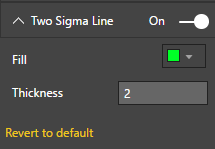
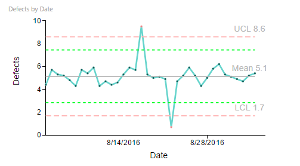

# Process Control Chart Capability Options

## Two Sigma Line

## Two Sigma Line - Custom Settings
"Two Sigma Line" Capability options help in setting display properties of Two Sigma Lines. Following example shows customized Two Sigma Line settings. In this example, Two Sigma Line is set to Visible and color set.

| Figure 1. “Two Sigma Line” Settings. | Figure 2. Process Control Chart with "Two Sigma Line". |
|---|---|
|   |  |
