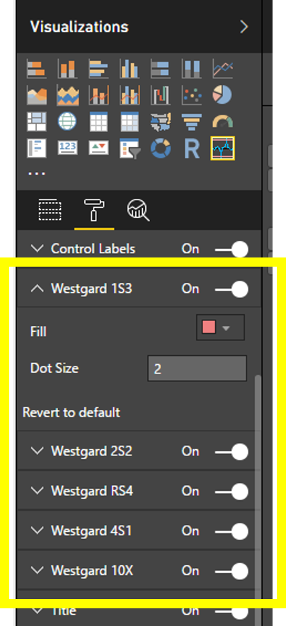
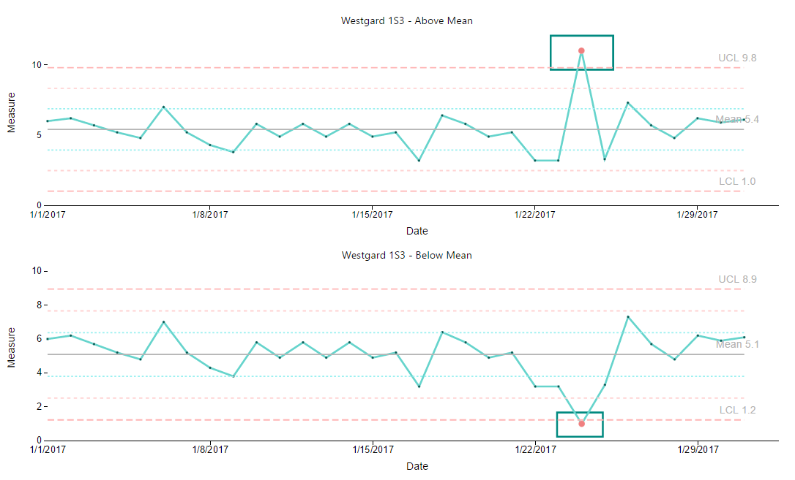
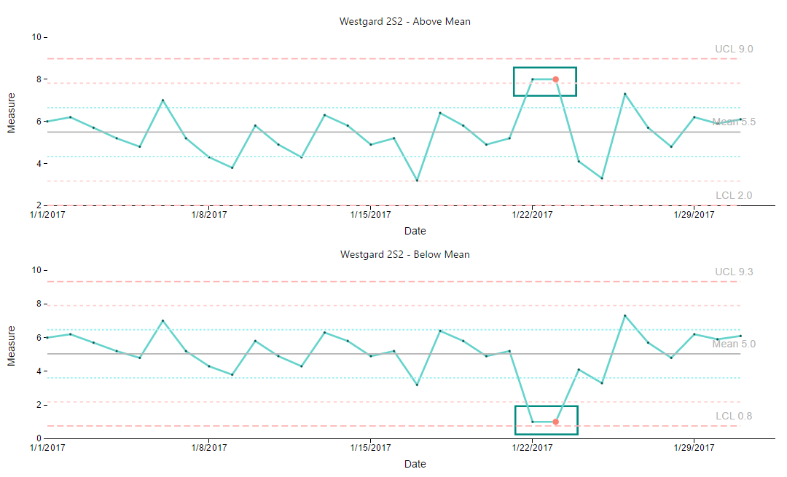
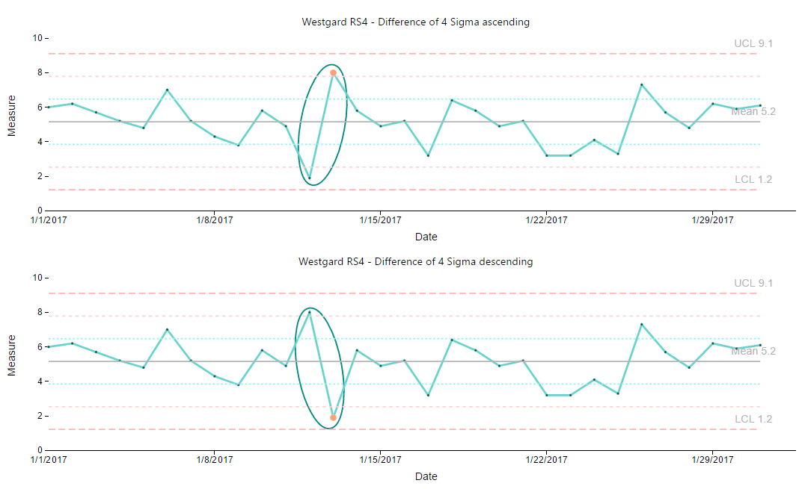
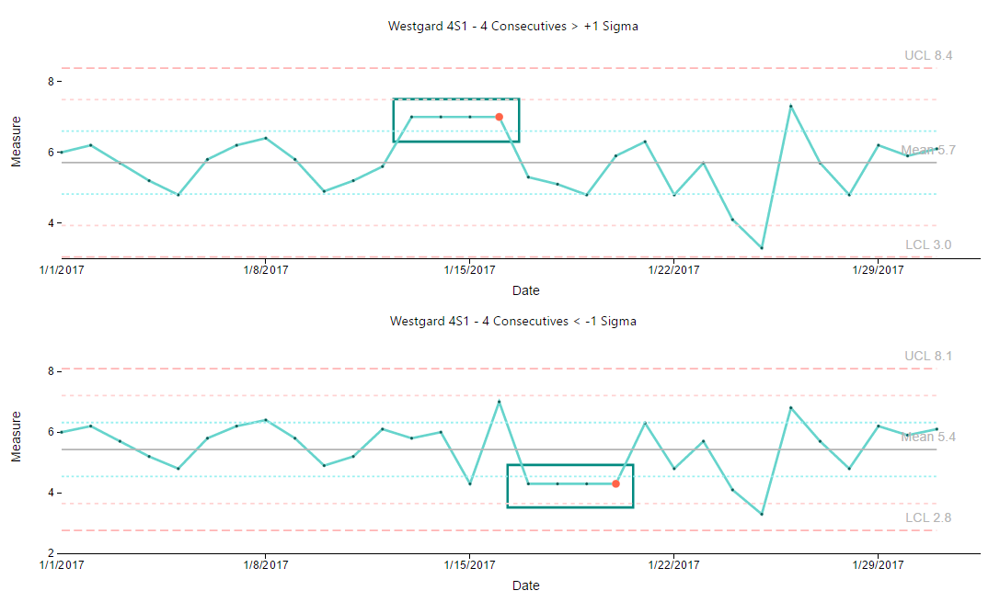
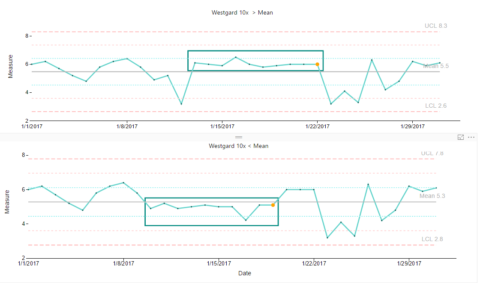

# Process Control Chart Capability Options

## Westgard Rules
Process Control Chart offers Capability options to control 5 [Westgard Rules](http://www.ncss.com/wp-content/themes/ncss/pdf/Procedures/NCSS/Levey-Jennings_Charts.pdf). They are,
1. Westgard 1S3
2. Westgard 2S2
3. Westgard RS4
3. Westgard 4S1
5. Westgard 10X 

These rules can be optionally enabled or disabled; their Colors and Dot Sizes can also be adjusted through the capability options shown in Figure 1 below.
## Westgard Rule Options - Custom Settings

| Figure 1. “Westgard Rules” Settings. |
|---|
|   |

## Westgard Rule Samples
Following samples are provided as references. Out of control sequences based on respective Westgard Rules are boxed below to highlight them but Process Control Chart Visual does not draw these boxs for you.

### Westgard 1S3 Sample
| Figure 2. 1S3 - 1 value beyond 3*sigma from the mean. |
|---|
|   |

### Westgard 2S2 Sample
| Figure 3. 2S2 - 2 consecutive values >, or <, 2*sigma from the mean. |
|---|
|   |

### Westgard RS4 Sample
| Figure 4. RS4 - A difference between consecutive values > 4*sigma. |
|---|
|   |

### Westgard 4S1 Sample
| Figure 5. 4S1 - 4 consecutive values >, or <, 1*sigma from the mean. |
|---|
|   |

### Westgard 10X  Sample
| Figure 6. 10X - 10 consecutive values >, or <, the mean. |
|---|
|   |
